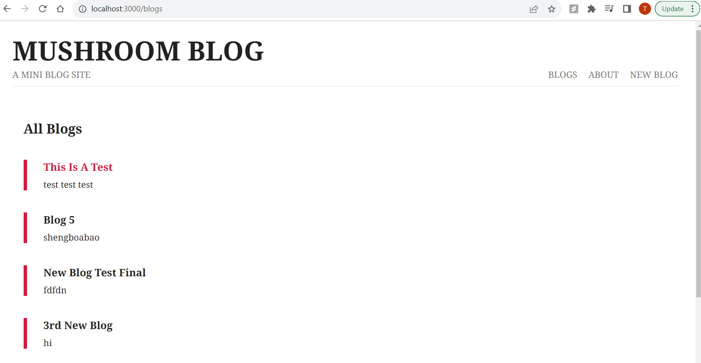
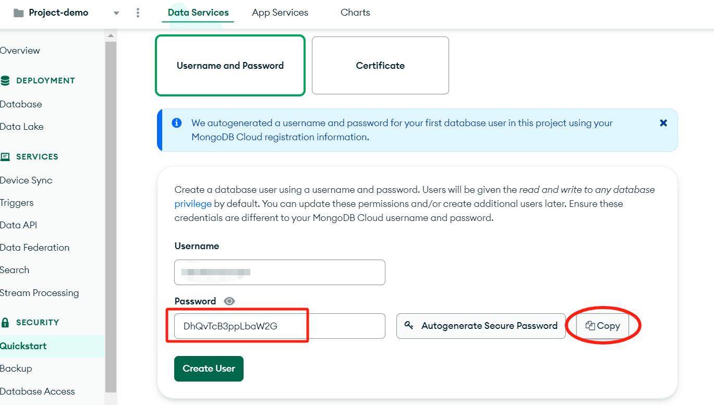
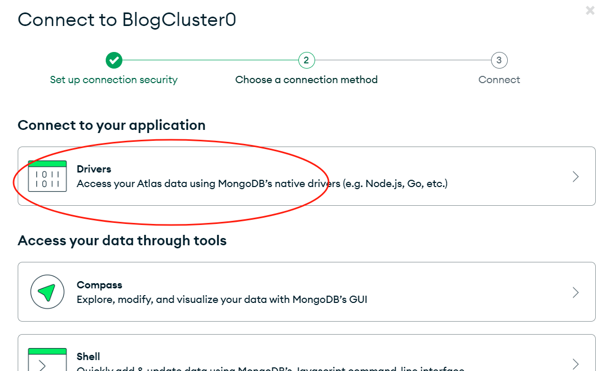
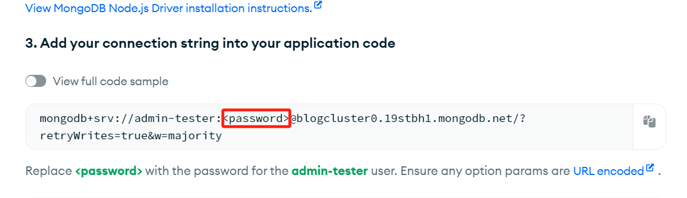
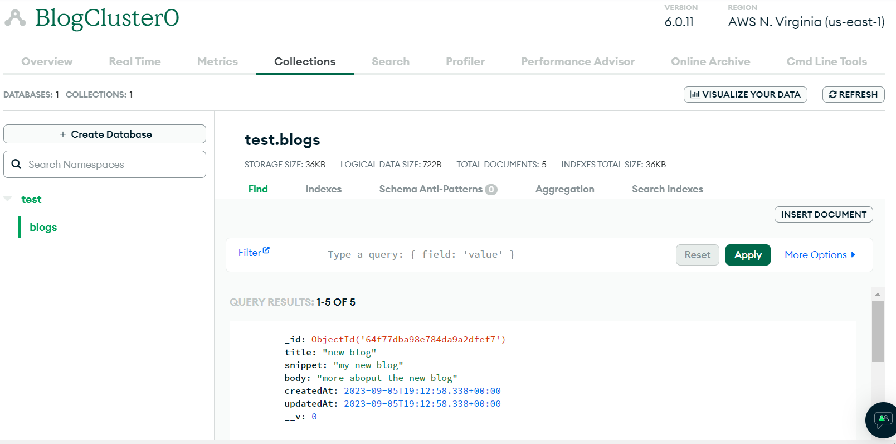

# Node Blog 
A blog website built by Node.js, Express.js and MongoDB.
For any questions, please email tianwen.chen.25@dartmouth.edu\
\
Home page view:

## User Instruction
* Clone the repository. Run `npm install` in the terminal. This will install all the required dependencies and packages onto your machine.
* Since this blog website use MongoDB as the database, you are going to need a MongoDB databse for your own:
    * Go to https://www.mongodb.com/cloud/atlas/register to log in, or sign up a MongoDB account. 
    * Create a database! Go to Project > Create New Project
    * Create a deployment of the project, and choose the third, **free** plan.
    * Follow the instruction to create a user and password. **Remember to copy the password!**
    
    * Scroll down and finish setting up the database.
    * Go to database, hit Connet.
    * Choose Drivers for Node app and hit next: 
    
    * Copy the following URI, with password **changed to the password you just copied** when creating a user.
    
    * Go to the `.env_sample` file, replace `your_database_uri_here_with_password` with the URI of your databse.
    * **Rename the file `.env_sample` to `.env`**
    * Now you've finished setting up the database!
* To run the blog website, type `nodemon app` in the terminal and run. Go to `localhost:3000` to check the app.
* To see the blog data, go to MongoDB database and go to Collections. The data will be displayed once you add them!
